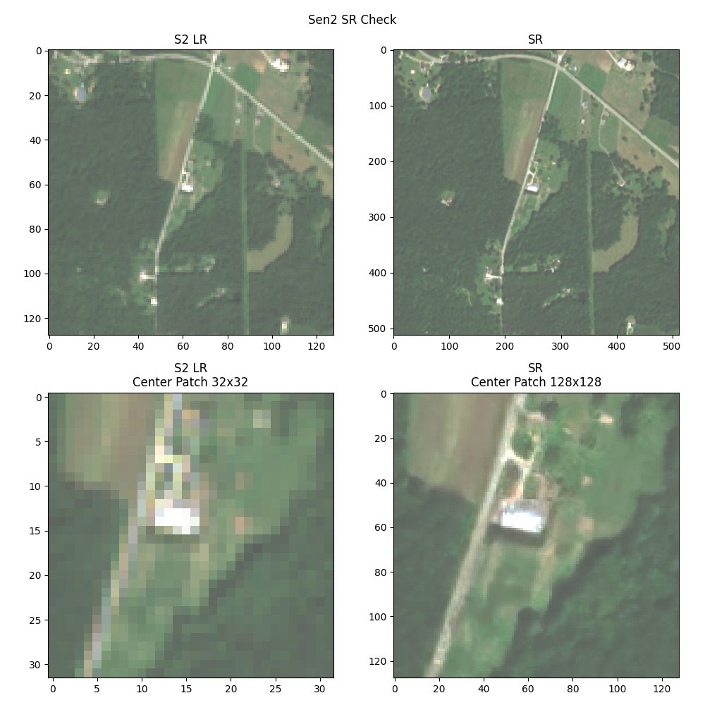
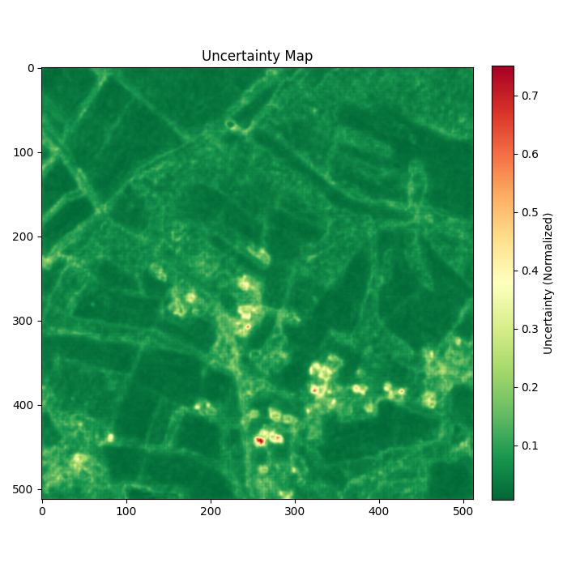

# Latent Diffusion Super-Resolution - Sentinel 2 (LDSR-S2)
<p align="center">
  
</p>

**Description**: This repository contains the code of the paper [Trustworthy Super-Resolution of Multispectral Sentinel-2 Imagery with Latent Diffusion](https://ieeexplore.ieee.org/abstract/document/10887321). This package contains the latent-diffusion model and weights to super-resolute the RGB-NIR bands of Sentinel-2. It can be embedded in the "opensr-utils" package in order to create a data pipeline for SR products. 

**🧪 Status**: LDSR-S2 has exited the experimental phase as of **v1.0.0**  
📌 For super-resolving **20m bands**, check out [`SEN2SR`](https://github.com/ESAOpenSR/SEN2SR), or use it alongside LDSR-S2 in the third notebook.
  
---

# Table of Contents
- [🚀 1. Interactive Notebooks - Google Colab](#1--google-colab-demos--interactive-notebooks)
- [🛠️ 2. Install and Usage - Local](#2-install-and-usage---local)
  - [🧱 2.1 Weights and Checkpoints](#21-weights-and-checkpoints)
- [🖼️ 3. Super-Resolution Examples](#3-super-resolution-examples)
  - [🛰️ 3.1 Example SR Image](#31-example-sr-image)
  - [🔎 3.2 Demo File and Uncertainty Calculation](#32-demo-file-and-uncertainty-calculation)
- [🗺️ 4. Inference on S2 Tiles: Data Pipeline](#4-inference-on-s2-tiles-data-pipeline)
- [📝 5. Notes](#5-notes)
  - [🎓 5.1 Training](#51-training)
  - [📚 5.2 Citation](#52-citation)
  - [📈 5.3 Status](#53-status)


## 1. 🚀 Interactive Notebooks - Google Colab

Run LDSR-S2 directly in Google Colab within seconds! These notebooks let you fetch Sentinel-2 imagery, apply super-resolution, and save results — with or without going through the code. The no-code version even implements a user interface to select and process data.

| Notebook Name                  | Description                                                                                      | Link                                                                 |
|-------------------------------|--------------------------------------------------------------------------------------------------|----------------------------------------------------------------------|
| **LDSR-S2 No-Code**           | 🔘 No coding required — chose point on a map and download SR results as GeoTIFFs               | [](https://colab.research.google.com/drive/1xhlVjGkHPF1znafSGrWtyZ0wzcogVRCe?usp=sharing) |
| **LDSR-S2 Walkthrough**              | 🧪 Code-level walkthrough with uncertainty estimation and advanced plotting                       | [](https://colab.research.google.com/drive/1onza61SP5IyiUQM85PtyVLz6JovvQ0TN?usp=sharing) |
| **LDSR-S2 & SEN2SR**          | 🔄 Use LDSR-S2 alongside SEN2SR to compare results on 10m + 20m bands                             | [](https://colab.research.google.com/drive/1NJuyswsquOLMFc_AP93P_5QcZnbNhGuB?usp=sharing) |

---


## 2. 🛠️ Install and Usage - Local
```bash
pip install opensr-model
```

Minimal Example  
```python
# Get Config
from io import StringIO
import requests
from omegaconf import OmegaConf
config_url = "https://raw.githubusercontent.com/ESAOpenSR/opensr-model/refs/heads/main/opensr_model/configs/config_10m.yaml"
response = requests.get(config_url)
config = OmegaConf.load(StringIO(response.text))

# Get Model
import torch
device = "cuda" if torch.cuda.is_available() else "cpu" # set device
import opensr_model # import pachage
model = opensr_model.SRLatentDiffusion(config, device=device) # create model
model.load_pretrained(config.ckpt_version) # load checkpoint
sr = model.forward(torch.rand(1,4,128,128), sampling_steps=100) # run SR
```  

### 2.1 🧱 Weights and Checkpoints
The model should load automatically with the `model.load_pretrained` command. Alternatively, the checkpoints can be found on [HuggingFace](https://huggingface.co/simon-donike/RS-SR-LTDF/tree/main).


# 3. 🖼️ Super-Resolution Examples

## 3.1 🛰️ Example SR Image
<p align="center">
  
</p>

## 3.2 🔎 Demo File and Uncertainty Calculation
Run the `demo.py` file to see how the package works. It super-resolves an example tensor and saves the corresponding uncertainty map.

<p align="center">
  
</p>

<p align="center">
  
</p>


# 4. 🗺️ Inference on S2 Tiles: Data Pipeline

This repository itself exposes the **raw model** for tensor‑level inference. By default it performs **128→512** super‑resolution on 4‑channel tensors (B×4×128×128 → B×4×512×512). It **does not** handle geospatial IO, tiling, or metadata.

For real‑world workflows on Sentinel‑2 data, please use **`opensr-utils`**:
- Run inference over **4‑band GeoTIFFs** (e.g., RGB‑NIR) or full Sentinel‑2 **`.SAFE` folders** (including **`.SAFE.zip`**).
- Handles **tiling**, **overlap blending**, **stitching**, and preserves **CRS/transform**.
- Works with every model (including this one), define LR‑space `window_size=128`, `factor=4`, overlap, and border trimming.
- Writes georeferenced outputs (e.g., GeoTIFF/COG), plus basic logs/metadata.

Minimal example (pseudocode; see `opensr-utils` for details):
```python
import opensr_utils
sr_job = opensr_utils.large_file_processing(
    root="/path/to/S2_tile.SAFE",  # also supports GeoTIFFs and .SAFE.zip
    model=model,                   # your SRLatentDiffusion instance
    window_size=(128, 128),        # LR patch size → 512px SR at factor=4
    factor=4,                      # 10m → 2.5m
    overlap=12,                    # LR‑space overlap to reduce seams
    eliminate_border_px=2,         # trim LR‑space border per tile
    device=device,                 # "cuda"/"cpu"
    gpus=0,                        # single GPU id or list for multi‑GPU
)
```

Use the notebooks and `demo.py` for quick starts; for full‑tile processing and proper georeferencing, prefer `opensr-utils`.


# 5. 📝 Notes

## 5.1 🎓 Training
Training is **not supported by default** in this repository due to time and resource constraints. The provided models are implemented as **PyTorch Lightning** modules and ship ready for inference. If you want to train or fine‑tune them, you can extend the module(s) by adding the standard Lightning hooks (e.g., `training_step`, `validation_step`, `configure_optimizers`, and any callbacks or loggers you prefer). If you build a clean, reproducible training pipeline, please consider opening a Pull Request (PR). We’re happy to review community contributions.

## 5.2 📚 Citation
If you use this model in your work, please cite  
```tex
@ARTICLE{ldsrs2,
  author={Donike, Simon and Aybar, Cesar and Gómez-Chova, Luis and Kalaitzis, Freddie},
  journal={IEEE Journal of Selected Topics in Applied Earth Observations and Remote Sensing}, 
  title={Trustworthy Super-Resolution of Multispectral Sentinel-2 Imagery With Latent Diffusion}, 
  year={2025},
  volume={18},
  number={},
  pages={6940-6952},
  doi={10.1109/JSTARS.2025.3542220}}
```

## 5.3 📈 Status
This repository has left the experimental stage with the publication of v1.0.0.   
[](https://pepy.tech/projects/opensr-model)